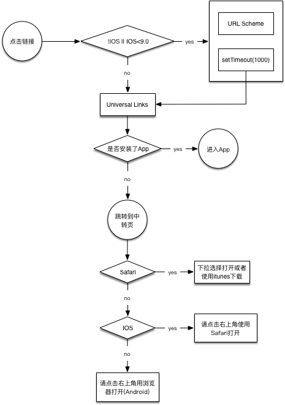

这个词我第一次是在[IONIC Deeplinks](http://ionicframework.com/docs/native/deeplinks/)中看到的，它表示在 H5 中使用一个链接（URL Scheme 或者 Universal Links）就能打开我们指定的 App。这样的需求可以参考下面的流程图：



因此，结合这个需求，我介绍下**DeepLinks 的概念和交互设计**。

## DeepLinks 的概念

在 H5 中点击链接跳转到 App 可以使用两个方式实现：**URL Scheme 或者 Universal Links**，URL Scheme 较为通用，Universal Links 为 IOS9.0+系统专属。

### URL Scheme

简单地说，就是使用这样的连接`mycoolapp://path?foo=bar`开启你的 App，例如：

```html
<a href="mycoolapp://">Open my app</a>
<a href="mycoolapp://somepath">Open my app</a>
<a href="mycoolapp://somepath?foo=bar">Open my app</a>
<a href="mycoolapp://?foo=bar">Open my app</a>
```

或者来一个真实的案例：

> 使用手机模式在**外部浏览器**中打开，且安装了`知乎`或者`网易新闻`，否则点击会报错或者没反应。

- 知乎: 《JS 判断 APP 是否安装?》 - [在「知乎」中打开](zhihu://questions/34831949?utm_campaign=ge19&utm_content=m_banner)

- 网易新闻: 《刘强东力挺顺丰：我相信王卫为人，质疑菜鸟违法》 - [在「网易新闻」中打开](newsapp://doc/CLU0M6DS00097U7R?s=sps_ulink&ss=sps_article)

#### 1. 给 IOS 的建议

上面的这种方式对全系的 Android 和 IOS 系统都适用，但是对于 IOS9.0+在 Safari 中会存在以下问题（以知乎为例）：

在 Safari 中点击链接会弹出`在“知乎”中打开？`的提示，且 JS 脚本此时不会中断，如果设置了`setTimeout`等操作则完全达不到预期，因为不知道用户什么时候会点击`打开`还是`取消`。

因此，建议使用**Universal Links**式。当用户安装了 App 则流畅的跳转到 App 中，如果没安装则进入**Universal Links**所指向的位置，一般是下载中转页。

#### 2. 给 Android 的建议

这个问题和 IOS9.0+在 Safari 中出现的问题相同，一些安卓机会有`ActionSheet`弹出提示是否进入 App 等选项，因此也会出现`setTimeout`失效的问题。目前「知乎」的方式是：第一次尝试使用**URL Scheme**，1000ms 后 H5 跳转到下载中转页而不做其他处理。

#### 3. 微信、微博、QQ、支付宝等壳子会拦截 URL Scheme

拦截的意思是点击了这样的链接会毫无反应，上面的示例链接可以在微信中体验下。但是 IOS9.0+使用`Universal Links`的方式上述平台是无法拦截的。因此，对于安卓用户只能跳转到**下载中转页**再做后续动作。

#### 4. URL Scheme 命名规则

- 不要使用已存在的 scheme，比如：zhihu、twitter、newsapp、fb 等
- 使用小写字母
- 不要使用`-`，因为安卓下会转化为`_`
- 使用一个单词且不加空格

#### 5. 建议

建议让 IOS 和 Android 的小伙伴提供一致规则的**URL Scheme**规则。

### Universal Links

这个方法是专属 IOS9.0+的，简单来说就是一种能够方便的通过传统的 HTTP/HTTPS 链接来启动 App，使用相同的网址打开网站和 App。如果英语可以的话建议阅读下面的链接：

- [Universal Links on iOS](https://developer.apple.com/library/content/documentation/General/Conceptual/AppSearch/UniversalLinks.html)

当用户点击链接时，如果安装了 App 则跳转到 App；如果没安装则打开链接指向的网址。相比于**URL Scheme**方案具有以下优点：

- **Unique**：因为是使用的标准 HTTP or HTTPS 链接到自己的网站，因此别的应用无法伪造
- **Secure**：IOS 系统会检查放在自己服务器上的`apple-app-site-association`文件，这个文件用于关联网站和 app 之间的联动关系
- **Flexible**：如果没安装应用，则点击`Universal Links`会跳转到关联的网址，可以是主页也可以是下载引导页
- **Simple**：一个 URL 连接可以给 App 服务，也可是一个简单的网站
- **Private**：别的应用无法拦截这个过程，也无法知道后续是开启 App 还是跳转到 Safari

#### 1. 这里给两个示例：

> 使用 IOS 手机在任何 webview 中打开，且安装了`知乎`或者`网易新闻`，否则点击就会进入链接指向的网站。

- 知乎: 《JS 判断 APP 是否安装?》 - [在「知乎」中打开](https://oia.zhihu.com/questions/34831949?utm_campaign=ge19)

- 网易新闻: 《刘强东力挺顺丰：我相信王卫为人，质疑菜鸟违法》 - [在「网易新闻」中打开](http://m.163.com/newsapp/applinks.html?path=%2Fdoc%2FCLU0M6DS00097U7R&s=sps_ulink&ss=sps_article)

#### 2. 如何获得 IOS 版本

```javascript
var arr = window.navigator.userAgent.match(/OS (\d+)_(\d+)?/);
var version = arr[1] + "." + arr[2];
// -> 9.1
```

### 使用何种方式触发跳转

这里有三种方式：

- iframe
- a 标签 href 属性
- window.location.href

现在网上给的方案都是大概 1 年左右，都倾向于使用 iframe，但是像「网易新闻」和「知乎」都是使用的`window.location.href`（翻看了源码），好吧，用这个方案吧。

> 在 IOS 的 Safari 上使用 iframe 方案点击无反应

## 交互设计

上面的关系理清，交互就很明确了，简单的流程如下图：


因为「网易新闻」和「知乎」两个平台都对`setTimeout`定时跳转没有处理，因此都会进入跳转中转页然后根据设备类型及壳子类型初始化对应的**操作提示**及**下载链接**。

关于这这部分的代码，请参考我写的一个 Demo 示例： [仿「知乎」中转页项目工程](https://github.com/xiangsongtao/oia-page)，如果需要对`setTimeout`处理的话，建议监听页面 hide 事件，对应的兼容库在这里：[visibly.js](https://github.com/addyosmani/visibly.js)。

## 最后

- 向 IOS 和 Android 的开发同时搞到 URL Scheme 链接
- 向 IOS 同事询问 Universal Links 的链接
- 准备 OIA 页面（下载指引页）

希望以上对你有用。
