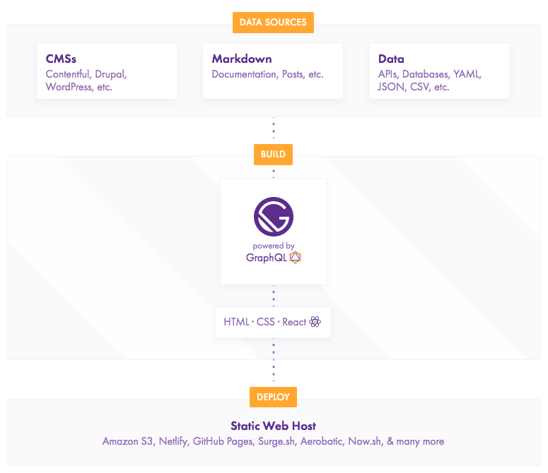

> 这里介绍的不是 SPA 和 PWA。

我觉得这可能是未来**前后端分离的新方式**，因为：

### 更快的页面显示

项目在构建时就能生成对应路由的静态页面，用户访问网页就能提前触发`DomContentLoaded`事件并渲染页面。这个在后面的一篇文章[《SSR 相关》](/ssr-xiang-guan-wen-da/)有介绍。

### 更方便的部署

前端项目骨架都静态化，因此资源可以走 CDN，这个没什么好说的。页面动态部分通过接口获取，可以使用 RESTAPI 也可以是 GraphQL。这样相对于传统的网页项目来说，静态化的方案可以大大节省服务器的资源。

### 解决方案成熟

**1. React -> Gatsby**

**2. Vue -> Nuxt**

## 参考

- [Web Performance 101—also, why is Gatsby so fast?](https://www.gatsbyjs.org/blog/2017-09-13-why-is-gatsby-so-fast/)
- [Gatsby](https://www.gatsbyjs.org/)
- [Nuxtjs](https://zh.nuxtjs.org/)
