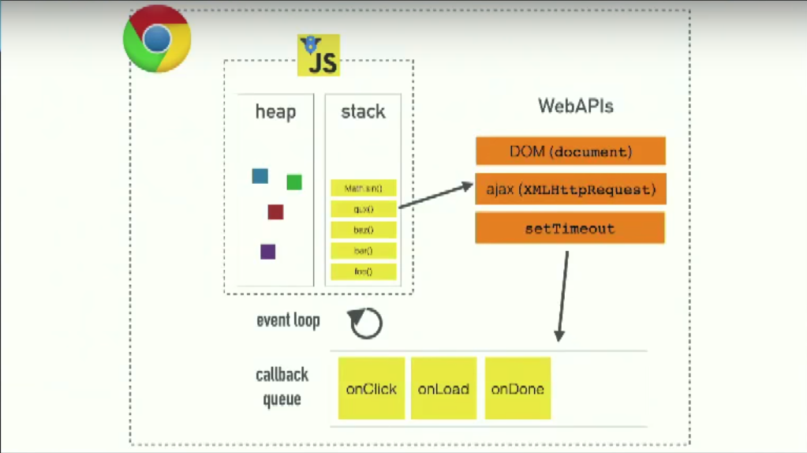
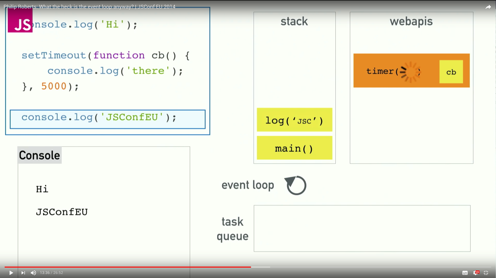
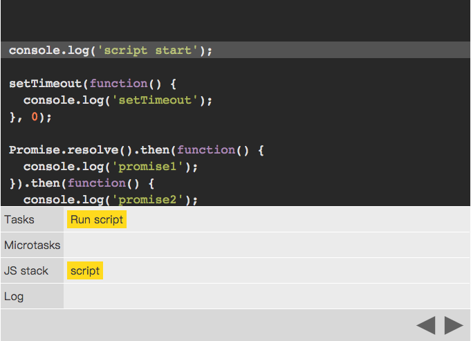
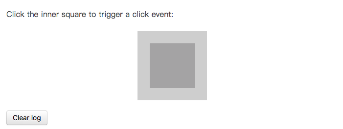

> 这里所指都是在浏览器环境中，而不是 Nodejs 环境。

## JS 异步机制

> 关于 JS 简要的运行机制及事件队列等知识**强烈**希望能翻墙看下这个视频：[地址](https://www.youtube.com/watch?v=8aGhZQkoFbQ)。

这里有个很重要的图需要深刻理解：



- Chrome 中的 V8 只处理 JS 的解析及执行（可能有歧义）
- JS 运行在单线程上，通过 event loop 完成异步调度
- DOM、XMLHTTPREquest、setTimeout、setInterval 等是异步的 WebAPIs
- 异步代码会被推入 callback queue（Tasks）中，当 stack 空闲时挨个推入 stack
- PS: microtasks 稍后介绍

这里是 Video 中关于执行一个异步操作时的图示：



- 当浏览器开始执行我们的代码时，会将 Script 推入 Tasks 中（就是`<script>`中的代码）
- 当 stack 为空，则 event loop 从 task queue 中取出一个任务执行
- 运行代码打印`Hi`
- 遇到`setTimeout`时，将回调推入 webapis 管理（里面有一个定时队列）
- 代码继续向下执行，输出`JSConfEU`，随后 stack 清空，**UI 刷新**
- 当定时时间到了，webapis 将回调推入 task queue 中，stack 此时为空，event loop 取一个任务推入 stack 执行
- 代码输出`there`

以上就是 JS 的异步执行过程，**Tasks**就是上图中的 task queue，**microtasks**在下面介绍。

## Tasks/microtasks 的区别

Google Chrome 的开发者 Jake 对存在 microtasks 时的情况有篇博文介绍的很详细，[地址](https://jakearchibald.com/2015/tasks-microtasks-queues-and-schedules/)，建议精读。以下通过代码解读用于区别 Tasks 和 microtasks。

### 代码解读 1:

当`setTimeout`和`Promise`同时存在时，代码示例及执行顺序说明如下：

```js
console.log("script start");

setTimeout(function() {
  console.log("setTimeout");
}, 0);

Promise.resolve()
  .then(function() {
    console.log("promise1");
  })
  .then(function() {
    console.log("promise2");
  });

console.log("script end");
```

下图中需要重点理解 Tasks、Microtasks、JS stack 这三个栈



**第一次 Task 执行：**

- 将当前的 script 推入 Tasks 中
- 执行第一段代码，输出`script start`
- setTimout 回调推入 webapis 的定时栈中
- Promise 的第一个 then 回调推入 Microtasks
- 执行最后一句输出`script end`
- **检查 Microtasks 中是否有任务**
- 执行推入的第一个 Promise 的 then 回调
- 输出`promise1`，之后将第二个 then 回调推入 Microtasks
- 检查 Microtasks 中是否有任务
- 执行推入的第二个 Promise 的 then 回调
- 输出`promise2`
- 第一个 Tasks 执行完毕，**刷新 UI**

**第二次 Task 执行：**

- webapis 根据定时将 setTimeout 回调推入 Tasks 中
- Event loop 从 Tasks 取出任务执行
- 输出`setTimeout`
- **检查 Microtasks 中没有任务**
- 当前 Task 执行完毕，**刷新 UI**

#### Tasks 和 microtasks 所涉及的 API：

- **Tasks**: setTimeout, setInterval, (setImmediate, I/O,) UI rendering
- **microtasks**: (process.nextTick,) Promise, MutationObserver

#### 需要注意的地方：

- microtasks 不是 webapis，他的优先级比 Tasks 高，每轮主流任务执行完毕都会检查 microtasks，检查完毕后这轮 Task 才结束
- micrtasks 为 js 逻辑的一部分，不涉及到 UI 等 web 功能，因此功能上应该和 setTimeout 等 webapis 作区分
- **每轮 Task 结束都会渲染 UI，为了防止 UI 卡死**
- setTimeout 由 webapis 管理，当定时时间到了，就推入 Tasks 中等待执行（不是立即执行）
- setTimeout 最短执行时间为 4ms，即使定时时间为 0

### 代码解读 2

两个父子关系的 div 绑定 click 事件，根据回调输出 log。



```html
<div class="outer">
  <div class="inner"></div>
</div>
```

```js
// Let's get hold of those elements
var outer = document.querySelector(".outer");
var inner = document.querySelector(".inner");

// Let's listen for attribute changes on the
// outer element
new MutationObserver(function() {
  console.log("mutate");
}).observe(outer, {
  attributes: true
});

// Here's a click listener…
function onClick() {
  console.log("click");

  setTimeout(function() {
    console.log("timeout");
  }, 0);

  Promise.resolve().then(function() {
    console.log("promise");
  });

  outer.setAttribute("data-random", Math.random());
}

// …which we'll attach to both elements
inner.addEventListener("click", onClick);
outer.addEventListener("click", onClick);
```

点击内部 div 后的执行过程如下：

**脚本执行：**

- 将 script 推如 Tasks，因为 stack 空闲，执行 script 脚本，完成事件绑定

**用户点击：**

- 用户点击 inner div
- 因为是在冒泡阶段触发，因此 inner 元素的 click 事件先触发，回调推入 Tasks 中
- 冒泡向上，outer 元素的 click 事件触发，回调推入 Tasks 中
- 当前没有 microtasks，Tasks 执行完毕，UI 更新

**第一个事件回调（inner）：**

- 从 Tasks 中取出任务（inner 元素的事件回调）
- 打印`click`，
- setTimout 回调推入 webapis 的定时栈中
- 将 Promise 的第一个 then 推入 microtasks 中
- 修改 outer 的属性触发监听，将 MutationObserver 推入 microtasks
- 检查 microtasks 中任务并执行
- 打印 `promise`和`mutate`
- 第一个回调执行完毕，执行第二个 click 事件回调

**第二个事件回调（outer）：**

- 从 Tasks 中取出任务（outer 元素的事件回调）
- 打印`click`，
- setTimout 回调推入 webapis 的定时栈中
- 将 Promise 的第一个 then 推入 microtasks 中
- 修改 outer 的属性触发监听，将 MutationObserver 推入 microtasks
- 检查 microtasks 中任务并执行
- 打印 `promise`和`mutate`
- 第二个回调执行完毕

**setTimeout 回调：**

- 上两个 Tasks 执行完毕，检查 webapis 是否有定时任务
- 将 inner 中的 setTimeout 推入 Tasks
- 执行回调输出`timeout`
- 检查 webapis 是否有定时任务
- 将 outer 中的 setTimeout 推入 Tasks
- 执行回调输出`timeout`

#### 需要注意的地方

- 注意冒泡过程添加 Tasks 的顺序
- Tasks 中的任务遵循先进先出的规则
- microtasks 中的任务在每次 Tasks 时都必须检查并执行完毕

## 参考

- [Tasks, microtasks, queues and schedules](https://jakearchibald.com/2015/tasks-microtasks-queues-and-schedules/)
- [Philip Roberts: What the heck is the event loop anyway? | JSConf EU 2014](https://www.youtube.com/watch?v=8aGhZQkoFbQ)
