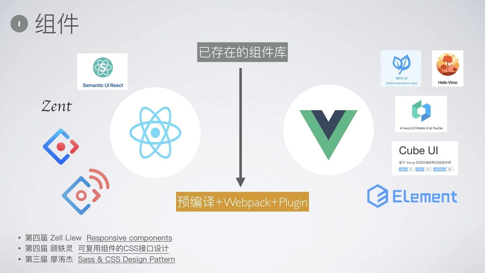
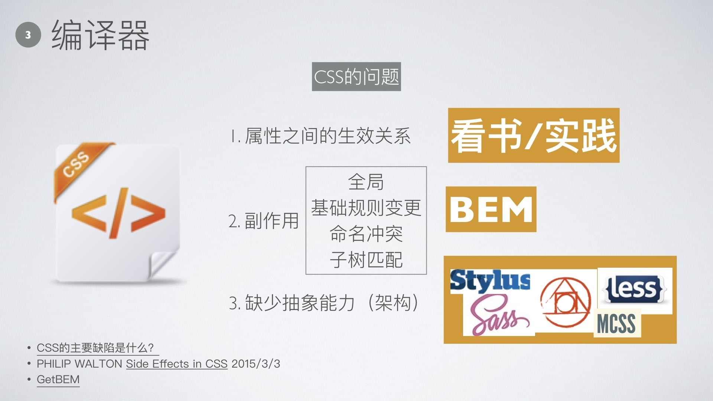
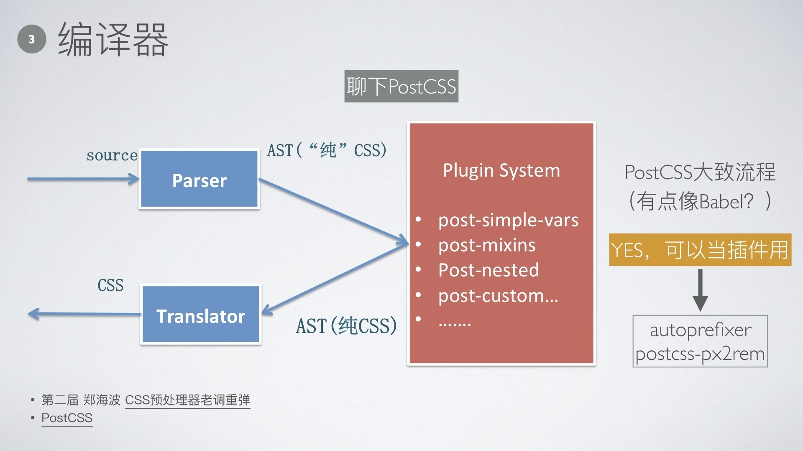
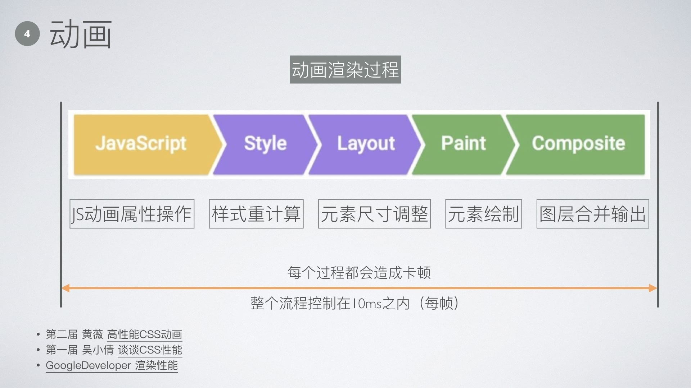
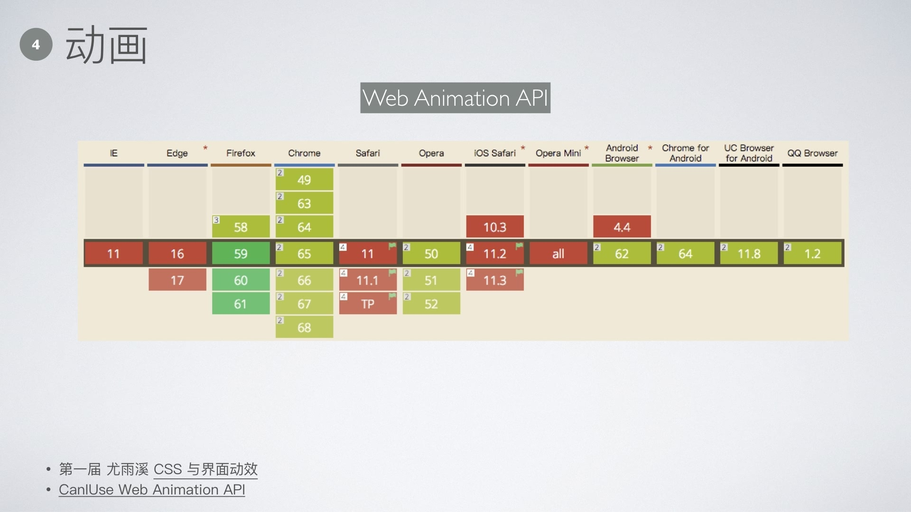
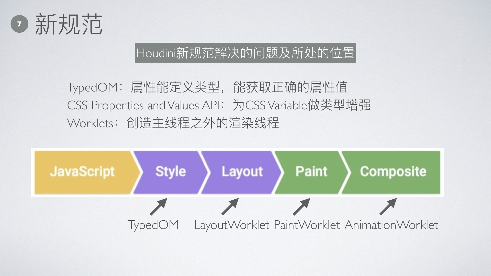

> PDF 下载地址：[CSSConf.pdf](CSSConf.pdf)

这个 Slides 是参加 CSS 大会的总结，因为要对小伙伴们分享，因此这个总结会比较“大”。是的，我搜集了**四届**的大会报告做了总结，引用的文章在每个 Slide 的页脚。

所谓**一通百通**，我希望这个 Slides 能帮到你理清 CSS 的脉络！

## BigMap

根据我搜集的 21 个报告做的如下分类。根据 CSS 展开，包括：组件库中 CSS 的位置、响应式、CSS 编译器、动画及性能、CSS 技巧、工程化相关、新规范和其他。

## 组件

组件库的构建套路固定，会一个其他的都类似。需要关注的是**结构与表象分离**的思想。

**结构与表象分离**目前都是通过插件解决，比如：`babel-plugin-import`、`babel-plugin-components`，我这里举个我正在做的插件`babel-plugin-vimo`，思路其实都是想通的。

我这里举的例子有点特殊，我是想说明，**如何分离**是需要根据实际情况来看的。

组件样式系统是层层构建的，类似于一个金字塔，上面的部分依赖下面部分。此外，还需要一个**书写规范（BEM）**做指引，满足工程化还需要再加上一个**预处理器（SCSS）**。这里举的例子是大多数项目在用的方案。

组件需要对外暴露样式修改接口，如图。

## 响应式

熟悉响应式常用的属性即可。

## 编译器

编译器的出现是为了解决 CSS 的问题（废话）。

PostCSS 需要关注，常用插件需要熟悉。对新规范的各种 Polyfill 需要知道有哪些是没实现的，别被插件带偏！！！

## 动画

> PS: 大漠的 PPT 稍微改下就能在很多地方讲。另外，干货少，报告更像是科普（没诚意）。

看看上面的优缺点，根据场景选择使用。

渲染过程要了然于胸，还是不清楚的下载 pdf 进入图片左下角的链接学习下。

总的来说，将网上的**最佳实践**对应到上图各个流程中，跟着走一遍，死记硬背是不管用的。

另外，**Reflow**、**Repaint**这两个词要改下了，因为那是在**FireFox**上的称呼，**Chrome**叫**Layout**和**Paint**！

WebAnimation 虽然浏览器支持度够呛，单已经有[Polyfill](https://github.com/web-animations/web-animations-js)了，现在可以在项目中用用。

## 技巧

技巧使用的都是不太常用的功能，比较有新意。

> 是不是我突发奇想实现一个很酷炫的功能是不是也能去 CSSConf 上讲讲了？heh...

## 工程化

做工程化关键是要有心。话说条条大路通罗马，唱反调的说上图的内容我就喜欢人肉搞，😔，加班有成就感存在感，你高兴就好。

## 新规范

开启新规范需要按照上图指示手动开启（2018/04/01），这里不确定未来是不是已自动集成了新特性。

新规范的位置我大概标了下，如果不对可以交流交流。

## 其他

学好 CSS 关键在于看书多练习，如果一次搞透那最好。

> 我不是书托 😀

## 总结

- 共性问题通过工具解决，别“Don’t Repeat Youself”
- 精⼒够的话再朝工程化⽅向发展，解决大多数人的效率问题
- 前端很简单，多思考练习
