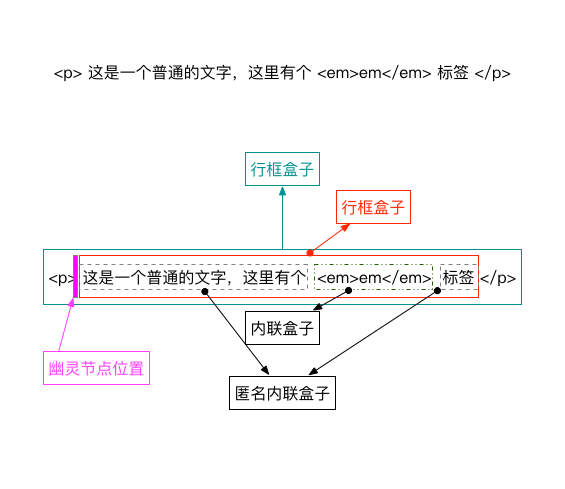
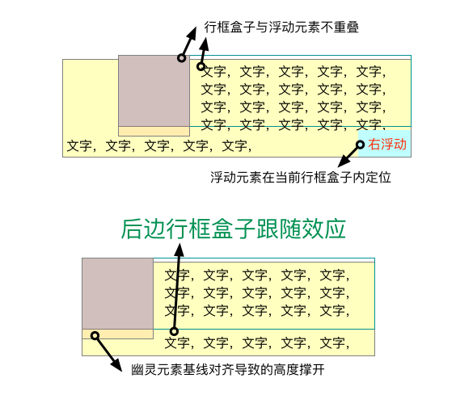
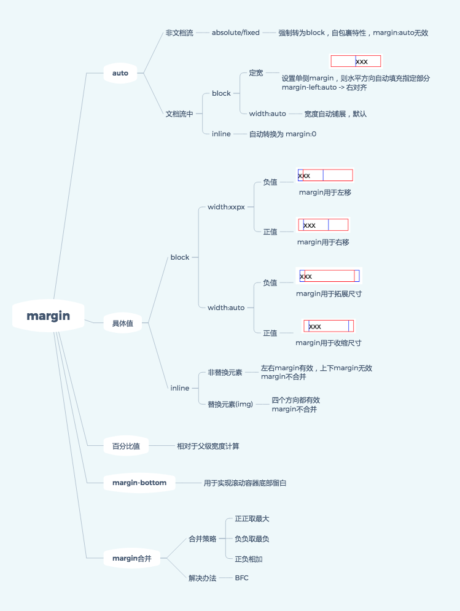
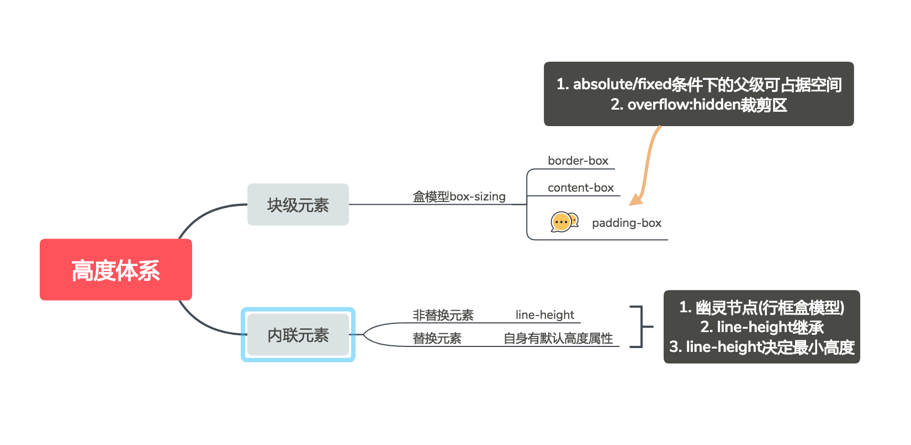

本书是著名博主张鑫旭的呕心沥血之作，涵盖了 CSS2.1 版本需要注意和知道的常用知识，我这里在看书总结时对以往不太清楚的地方做个深入整理，理清自己的知识体系树。

**知识应该成体系**才能方便我们日后工作中对内部信息进行快速检索，所以我在看这本书的同时会画一些结构树（思维导图），以便让我能更深入的理解 CSS 中的一些**“怪异、特殊”**的行为。

**需要重点说明的是**：本书是对 CSS2.1 的介绍与总结，最新的 CSS3 的内容需要从别的地方获取资料学习。

## 前言

### 了解“流”

HTML+CSS 最初是用于图文信息排版，因此浏览器默认是以“流”的方式进行**默认排版（预设）**，即内容从上向下，从左往右。此外，文本、段落、图片等内容又因为是否自动换行而分为**类联元素**和**块级元素**。对于现代的应用的界面绘制，需要清楚有这个**默认基础**！

### CSS 生效规则

- 不同元素的样式预设不一样
- 通过堆叠 CSS 属性修改元素样式
- 不同 CSS 属性之间会互相影响
- CSS 属性是有层叠关系及从属关系

## 块级元素

块级元素（block/inline-block）一般用于**段落**或者**结构展示**，或者能使`height`和`width`生效的元素。因此可以成为“容器盒子”。也就是说，内联元素（inline）和`height`和`width`没半毛钱关系！

### 1. `width:auto`

属性的作用效果与元素的 display 属性密切相关，可以是宽度自适应、包裹特性、收缩到最小等。

### 2. `box-sizing`

老生常谈的属性，需要知道：

- `border-box`、`padding-box`规定了`width`和`height`的作用边界（规则）
- `position:absolute`元素 100%尺寸永远以`padding-box`为边界
- `margin`的背景永远透明

### 3. `height:100%`

父元素**必须有可生效的值**，子元素的高度百分比才生效，否则为转为`auto`

### 4. `min-width/max-width`

- 为自适应布局、流体布局而生
- `min-width/min-height`的初始值为`auto`
- `max-width/max-height`的初始值为`none`
- 如果元素的`max-height`比`height`计算值大，则元素的高度自动转为`height`值

### 5 `margin`

块级元素的 margin 内容较多：

- `margin box`表示元素占据的空间尺寸，设置**负值**可拓展元素尺寸，**前提是 `display:block; width:auto`!**
- 滚动容器的底部留白用`margin-bottom`实现
- 垂直方向`margin`合并不是 bug，可通过块状格式化上下文（Block Formatting Context-BFC）设置隔离区
- `margin:auto`用于占据剩余空间，实现左中右对其效果

## 内联元素

### 1. 内联元素的种类区分？

```css
display: inline;
display: inline-block;
display: inline-table;
display: inline-x;
```

内联所指的是外在盒子，能和文字一行显示（排除浮动元素）。

### 2. 内联盒模型？

重点理解**“行框盒子”**的位置！如图：



> 注意：`p`标签中每一行都是一个行框盒子！！！

### 3. 幽灵节点概念？

需要知道的限定条件：

- 只是**HTML5 文档申明**中
- 在<mark>**每个行框盒子前面**</mark>有一个“幽灵空白节点”，不占据任何宽度但又确实存在，具有当前继承属性的**字体和行高**

幽灵节点用于解释一些内联盒模型存在的“怪异行为”，需要重点理解。

### 4. 替换元素和非替换元素的区别？

**替换元素**：通过修改某个属性值就可以替换呈现的内容的元素，比如``。

**非替换元素**: 就是传统的内联元素，比如`<span>`

- 默认情况下，替换元素和非替换元素都是**内联元素**
- 替换元素有自己的固有尺寸
- 替换元素和非替换元素之间只隔了一个`src/CSS content`属性

### 5. `padding`

内联元素的 padding 在**垂直方向**会影响布局，会影响视觉表现，但是并没有可视宽高的概念（width/height 不生效），不占据垂直尺寸。

### 6. `border`

内联元素设置 border 是会生效的，但是如同 5 的解释，水平方向占据尺寸；**垂直方向影响视觉表现，不占据尺寸**。

### 7. `margin`

具有`display:inline`属性的非替换元素（`<span>`）的垂直`margin`是无效的。**需要理解下内联元素文本展示的属性。**

### 8. `line-height`和`vertical-align`

- <mark>内联元素高度全权由 line-height 属性决定!!!</mark>
- 分析内联元素的结构要时刻考虑：**继承特性**、**幽灵节点**、**默认 baseline 对齐**、**替换元素的 baseline 为下边缘**
- `vertical-align`不是真正的垂直居中，考虑下字符`x`
- `line-height`不同单位继承特性不同，数值属性直接向下传递，其他属性计算后传递
- `vertical-align`的生效前提是：**内联元素及 display 值为 table-cell 的元素**。这个过程需要注意 float 和 absolute 会强制改变**display->block**。

## 浮动元素

### 1. 浮动的本质是？

浮动的本质是为了**实现文字环绕效果**。因此在布局时会使自己的高度塌陷，让后面的**行框盒子**向上排布。这里需要注意的是：

- 行框盒子和浮动元素**不可重叠**（正是浮动效果产生的原因）
- 行框盒子外边的**块状容器盒子**是在包含浮动元素的
- 浮动元素的几何尺寸会影响外部行框元素的布局（浮动跟随的 bug）
- 浮动元素在当前**行框盒子**内定位，每行都是一个行框盒子
- 即使没有行框盒子也存在一个类似于幽灵节点的**浮动锚点**，其表现如同空的内联元素
- **注意：图中每行都是一个行框盒子**



### 2. 是否建议使用浮动布局？

不建议现在（2018/04/22）用于浮动布局，因为：

1.  布局容错性差
2.  性能比 flex 差
3.  hack 模式较多

### 3. `clear:both`

**`clear`属性的含义：**

元素盒子的边不能和前面的浮动元素相邻，本质是让自己不和 float 元素在一行显示

**正确的观点：**

- **浮动一直存在并没有清除**
- `clear`属性只有**块级元素**才生效，因此如果使用伪类消除浮动影响需要设置 display:table/block 等值

```css
.clear:after {
  content: "";
  display: table;
  clear: both;
}
```

## BFC——块级格式化上下文

**BFC(Block Formatting Context) 块级格式化上下文，通过特定属性创造一个封闭空间，内外不会产生影响。**可用于：

- 清除浮动
- 消除 margin 层叠问题

**开启办法：**

- `html`根元素
- `float`不为`none`
- <mark>`overflow`为`auto`、`scroll`、`hidden`</mark>
- `display`为`table-cell`、`table-caption`、 <mark>`inline-block` </mark>
- <mark>`position`不为`relative`、`static`</mark>（就是要脱离文档流才能形成 BFC，absolute/fixed）
- 设置伪类，如下

```css
.parent:before {
  content: " ";
  display: table;
}
```

## Overflow

- 裁剪边界：border-box 的内边缘（padding-box 外边缘，和 absolute 的最大尺寸相同）
- 在 PC 端，滚动条都来自 html 元素，而不是 body 元素
- window 系统的滚动条宽度均为 17px
- 即使使用 hidden 属性，内容元素也是可以通过 js 滚动的，**差别在于是否存在滚动条**

## 锚点定位

> 基础部分不清楚，汗颜，其本质就是通过`scrollTop`、`scrollLeft`进行滚动。

```html
<!-- 点击链接 -->
<a href="#target">Jump</a>

<!-- 滚动到指定位置 -->
<a name="target"> target name </a>
<h3 id="target id"></h3> <!-- 推荐 -->
```

触发锚点定位的两种情况：

- URL 中的 hash 锚点有对应的页面元素 -> 会触发**由内而外**的容器滚动行为
- 可 focus 的锚点元素处于 focus 状态 -> 只要 focus 元素在浏览器的窗体中，就不会触发流体滚动

以上，根据情况活用。

## position: absolute

- position: absolute/fixed -> display: block/table，这个是自动设置的（根据情况对应）
- absolute 具有尺寸包裹性，设置方位后具有自适应特性（常用的 top:0; left:0; right:0; bottom:0）
- absolute 相对于不为`static`的**祖先元素**计算指定定位
- 尺寸边界 -> padding-box（包含块）
- 当未设置定位属性时（和 fixed 类似），1）相对于原有位置定位；2）只是脱离文档流（而已）

## write-mode 改变文档流方向

由之前的水平规则完全变为垂直规则，这能衍生出很多 hack 技巧，这是一个打开思路的属性！！！

## 思维导图




