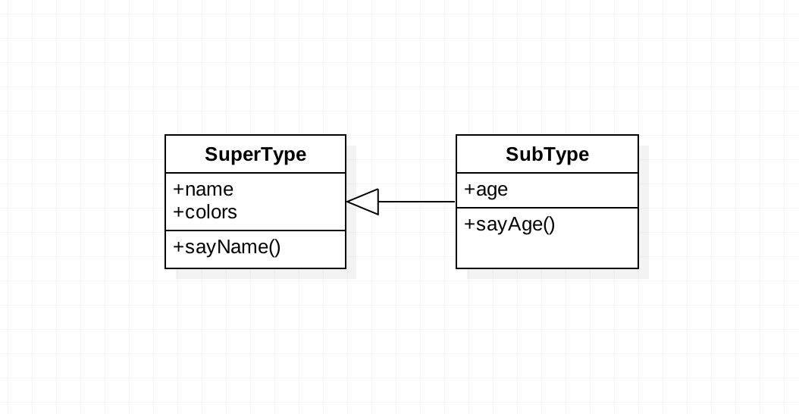

> 这篇文章总结 class 相关，并辐射出周边需要了解的知识点，便于形成巩固自己的心理表征。

## 如何编写一个类？

在 ES6 还没出来之前，前端在编写 class 时，相比去其他设计成熟的语言会显得很诡异，比如使用 JS 原生的方式实现一个类继承，这个我在之前的文章中有说明。

- [第六章 面相对象的程序设计(简单实现一个最理想的继承范式?)](https://xiangsongtao.github.io/blog/di-liu-lu-zhang-mian-xiang-dui-xiang/#16-%E7%AE%80%E5%8D%95%E5%AE%9E%E7%8E%B0%E4%B8%80%E4%B8%AA%E6%9C%80%E7%90%86%E6%83%B3%E7%9A%84%E7%BB%A7%E6%89%BF%E8%8C%83%E5%BC%8F)
- [第六章 面相对象的程序设计(new 操作符执行的过程?)](https://xiangsongtao.github.io/blog/di-liu-lu-zhang-mian-xiang-dui-xiang/#2-code-classlanguage-textnewcode%E6%93%8D%E4%BD%9C%E7%AC%A6%E6%89%A7%E8%A1%8C%E7%9A%84%E8%BF%87%E7%A8%8B)

下面是 UML 说明：



传统的基于原型的实现：

```js
// 1. 父类定义
function SuperType(name) {
  this.name = name;
  this.colors = ["red", "blue", "green"];
}

SuperType.prototype.sayName = function() {
  console.log(this.name);
};

// 2. 子类定义
function SubType(name, age) {
  // 2.1 继承了 SuperType 构造函数中定义的属性
  SuperType.call(this, name);
  // 2.2 子类自己的属性
  this.age = age;
}

// 父类原型链复制
SubType.prototype = Object.create(SuperType.prototype);
// 因为使用“.prototype =...”后,constructor会改变为“=...”的那个
// constructor，所以要重新指定.constructor 为自身。
SubType.prototype.constructor = SubType;
SubType.prototype.sayAge = function() {
  console.log(this.age);
};

// 3. 实例化
var instance1 = new SubType("name1", 12);
instance1.colors.push("black");
instance1.sayName(); // name1
console.log(instance1.colors); //"red,blue,green,black"

var instance2 = new SubType("name2", 33);
instance2.sayName(); // name2
console.log(instance2.colors); //"red,blue,green"
```

ES6 出来之后，关于 class 的实现就和其他高级语言差不多了，但是也仅仅是阉割版。ES6 实现如下：

```js
// 1. 父类定义
class SuperType {
  constructor(name) {
    this.name = name;
    this.colors = ["red", "blue", "green"];
  }
  sayName() {
    console.log(this.name);
  }
}

// 2. 子类定义
class SubType extends SuperType {
  constructor(name, age) {
    // 2.1 继承了 SuperType 构造函数中定义的属性
    super(name);
    // 2.2 子类自己的属性
    this.age = age;
  }
  sayAge() {
    console.log(this.age);
  }
}

// 3. 实例化
var instance1 = new SubType("name1", 12);
instance1.colors.push("black");
instance1.sayName(); // name1
console.log(instance1.colors); //"red,blue,green,black"

var instance2 = new SubType("name2", 33);
instance2.sayName(); // name2
console.log(instance2.colors); //"red,blue,green"
```

TypeScript 加强了 class 的实现，这也是我比较看好 TypeScript 的原因，可以渐进的从弱类型（指定 any）一直到强类型（指定类型）过渡。下面是 TypeScript 实现相同功能的代码，从代码中可以看出，其实代码没变化多少：

```typescript
// 1. 父类定义
class SuperType {
  constructor(name: string) {
    this.name = name;
    this.colors = ["red", "blue", "green"];
  }
  sayName() {
    console.log(this.name);
  }
}

// 2. 子类定义
class SubType extends SuperType {
  constructor(name: string, age: number) {
    // 2.1 继承了 SuperType 构造函数中定义的属性
    super(name);
    // 2.2 子类自己的属性
    this.age = age;
  }
  sayAge() {
    console.log(this.age);
  }
}

// 3. 实例化
var instance1 = new SubType("name1", 12);
instance1.colors.push("black");
instance1.sayName(); // name1
console.log(instance1.colors); //"red,blue,green,black"

var instance2 = new SubType("name2", 33);
instance2.sayName(); // name2
console.log(instance2.colors); //"red,blue,green"
```

通过以上的发展对比可以看出，前端的 JavaScript 基础设施正在被加强，且都有背后大厂的支持，未来能够继续保持比较快的发展趋势。这也是我为什么喜欢前端的原因。

## ES6 中使用 class 的注意点有哪些？

- class 先定义再使用，**不存在变量提升**
- **不存在私有属性和方法**

- 可以定义**静态属性和方法**，静态方法中的 this 指向 class 本身

```typescript
class Foo {
  static bar() {
    this.baz(); // this === Foo
  }
  static baz() {
    console.log("hello");
  }
  baz() {
    console.log("world");
  }
}

Foo.bar(); // hello
```

- 实例属性可以不在`constructor`中定义，直接写在外面

```typescript
class ReactCounter extends React.Component {
  state = {
    count: 0
  };
}
```

- `new.target`的使用技巧：**感知当前类的继承情况**

```typescript
class Shape {
  constructor() {
    if (new.target === Shape) {
      throw new Error("本类不能实例化");
    }
  }
}

class Rectangle extends Shape {
  constructor(length, width) {
    super();
    // ...
  }
}

var x = new Shape(); // 报错
var y = new Rectangle(3, 4); // 正确
```

- 理解继承类中的`super`函数（这部分有三种情况）

```typescript
class Parent {
  static myMethod(msg) {
    console.log("static", msg);
  }

  myMethod(msg) {
    console.log("instance", msg);
  }
}

class Child extends Parent {
  constructor(name) {
    super(); // 1. super()===Parent.prototype.constructor.call(this)
    this.name = name;
  }
  static myMethod(msg) {
    super.myMethod(msg); // 2. super===Parent
  }

  myMethod(msg) {
    super.myMethod(msg); // 3. super===Parent.prototype, 父类原型上的方法
  }
}

Child.myMethod(1); // static 1

var child = new Child();
child.myMethod(2); // instance 2
```

## TypeScript 中使用 class 的注意点有哪些？

相关的注意点完全继承上面的关于 ES6 的内容，需要额外指明的如下：

- 支持 public、private、protected
- 支持 readonly 属性
- [其余参考文档](https://www.tslang.cn/docs/handbook/classes.html)
