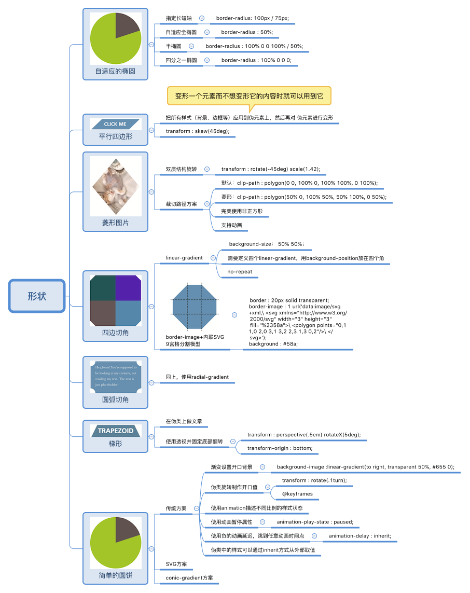
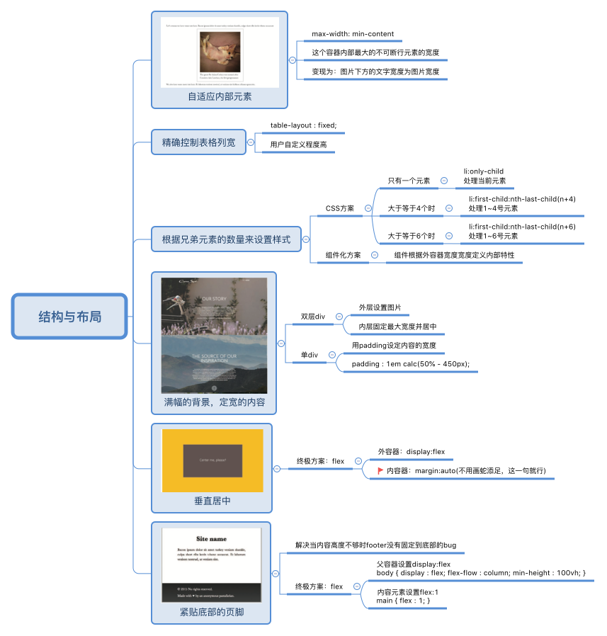
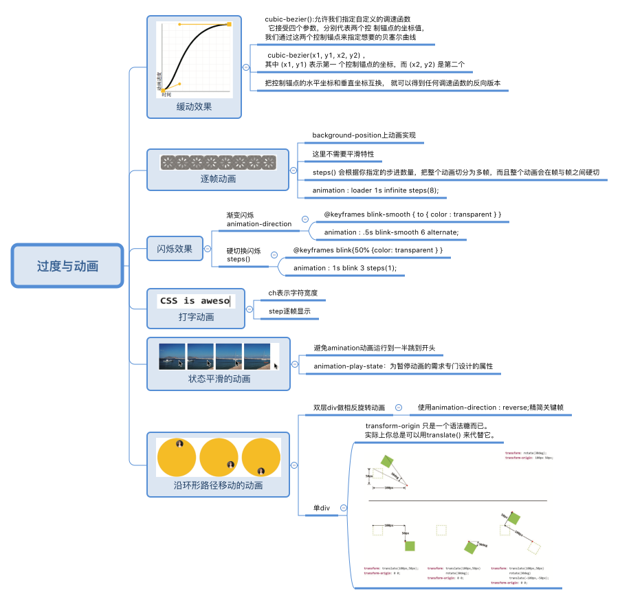

原版《CSS Secrets》是由 LEA VEROU 编写，主要介绍网页设计中比较经典的 CSS 实现方案及编写技巧。中文版由“CSS 魔法”翻译，在阅读过程中个人感觉翻译的还是很到位的，这里点个赞。

> CSS Secrets: Better Solutions to Everyday Web Design Problems

这篇文章是对《CSS 揭秘》一书的总结，以思维导图的方式将书中脉络梳理出来，在过一遍书中知识点时做到查漏补缺。另外，通过一次梳理就记住 CSS 编写时的技巧基本不可能，希望以后遇到类似问题时能快速查到解决方案。

## CSS 编码技巧

#### 思维导图

#### 备注

CSS 的编写和 JavaScript 的思维模型还是有很大差距的，CSS 中不同属性的组合是会产生不同效果的，这个也是 CSS 使用者头疼的问题，比如对 span 标签设置 height 为什么不生效的问题、内部元素 margin-top 会影响外容器、浮动清除等问题。因此，CSS 在编写时需要了解以下部分：

- 理解
  - 流的方式排版
  - 块级盒模型（块级元素）
  - 行框盒模型（内联元素）
  - 幽灵节点
  - BFC：块级格式化上下文
  - 浮动元素
  - 定位
  - flex、grid
- 熟记
  - 各种属性的特点
  - 不同盒模型下属性生效规则
  - 属性的默认表现
  - 属性堆叠覆盖
  - 属性的继承关系
- 新规范
  - CSS Hudini
  - CSS Grid
  - xx Worklet
  - CSS Variable
- 兼容性
  - CanIUse
  - autoprefix
- 预处理器
  - SCSS
  - LESS
  - Stylus
- 组件库的样式系统设计
  - 主题切换方案
  - 组件样式
  - 命名规范（BEM）
  - fn/mixin
  - 变量
- Scoped CSS
  - CSS Module
  - CSS-In-JS

我认为一个合格的前端以上都是必须要理解 8~9 成的。

## 背景与边框

#### 思维导图

#### 备注

- CSS 渐变部分参考这部分[《关于 linear-gradient()你需要知道的事儿》](/guan-yu-linear-gradient-ni-xu/)
- background 支持多属性
- background-clip：背景裁切
- background-origin：用于改变 background-position 定位边界

## 形状

#### 思维导图

#### 备注

- 一个元素有两个伪类（before、after）可以帮我们处理些难搞的背景需求
- clip-path：用于图片裁切
- animation 是能暂停的，并能设置某个暂停时间的表现状态，类似于“切帧”的概念

## 视觉效果

#### 思维导图

#### 备注

- 不规则元素的阴影使用 drop-shadow 滤镜处理

## 字体排印

#### 思维导图

#### 备注

- 自定义下划线效果使用还是蛮频繁的
- text-shadow 是能重叠书写的

## 用户体验

#### 思维导图

#### 备注

- blur 的逻辑是对某个 div 内部内容整体虚化，div 底部的内容还是能穿透上来正常显示
- 扩大点击区域使用伪类处理是最佳选择

## 结构与布局

#### 思维导图

#### 备注

- flex 布局方案是最终方案，尤其是在现在(2018)，如果面试有遇到需要了解 Hack 的情况，请珍爱生命，立刻停止面试
- 响应式设计除了根据屏幕宽度，还可以根据**当前组件的**外容器的尺寸响应

## 过度与动画

#### 思维导图

#### 备注

- “transform-origin 只是语法糖”这部分让我大开眼界
- 在某些情况，使用 animation-direction 可以精简关键帧

（完）
