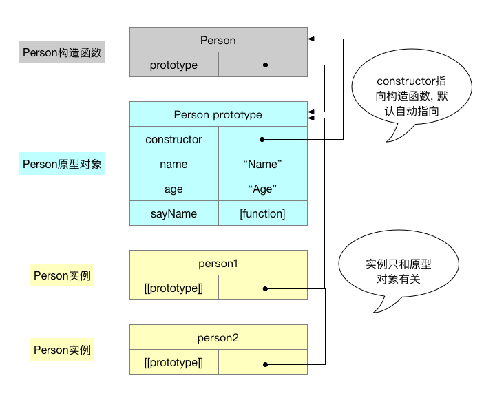

### 1. 对象定义?

无需属性的集合, 其属性可以包含基本值/对象/函数; 或者, **没有特定顺序**的散列表.

> 或者, 使用 js 实现一个散列表?
> 答: var a = {};

### 2. `new`操作符执行的过程?

```js
// 代码
var obj = new Base();

// 拆解
// 1. 创建（或者说构造）一个全新的对象；
var _obj = {};

// 2. 我们将这个空对象的__proto__成员指向了Base函数对象prototype成员对象
_obj.__proto__ = Base.prototype;

// 3. 我们将Base函数对象的this指针替换成_obj，然后再调用Base函数
var _return = Base.call(_obj);

// 4 如果函数没有返回其他对象，那么new表达式中的函数调用会自动返回这个新对象
if (typeof _return === "object") {
  obj = _return;
} else {
  obj = _obj;
}
```

### 3. 下面的输出结果是?

```js
function Base() {
  this.name = "Name";
}

var obj = new Base();

console.log(obj.constructor === Base); // true
console.log(obj.constructor === Object); // false
console.log(obj instanceof Base); // true
console.log(obj instanceof Object); // true
console.log(typeof obj === "object"); // true
```

### 4. 谈谈你对 prototype 的理解?

- 每个函数都有一个`[[Prototype]]`(原型)属性, 这个属性是一个指针, 指向 prototype 原型对象
- prototype 原型对象的用途是包含可以由特定类型的**所有实例共享的**属性和方法
- prototype 原型对象会自动获得 constructor(构造函数)属性
- **_实例的`[[Prototype]]`_**就是上面提到的*prototype 原型对象*, 在个别浏览器中则为可访问的`__proto__`属性

### 5. 解释为什么不建议在代码中使用`__proto__`属性?

**解释:**

首先, 每个实例都有一个指向**原型对象**的内部属性, 在规范中, 这个内部属性叫`[[Prototype]]`, 虽然`[[Prototype]]`ES 标准中没有直接访问的属性, 但是在 Firefox/Safari/Chrome 可以通过`__proto__`属性访问, 别的浏览器就无法支持, 所以如问题描述.

**替代方案:**

- 通过`Object.getPrototypeOf()`返回`[[Prototype]]`的值.

```js
function Base() {
  this.name = "Name";
}
Base.prototype.sayName = function() {
  console.log(this.name);
};

var obj = new Base();
console.log(Object.getPrototypeOf(obj) === Base.prototype); // true
```

- 通过`isPrototypeOf()`判断原型是否和实例的`[[Prototype]]`相等.

```js
console.log(Base.prototype.isPrototypeOf(obj)); // true
```

### 6. 为什么不建议`Object.defineProperty()`中的`get`和`set`函数分开使用?

只设置其一会导致另一个功能不可用, 比如:

- 只设置 get 函数, 则无法设置值
- 只设置 set 函数, 则获取值的值为 `undefined`

### 7. 理解 ECMAScript 中原型对象的性质

我们创建的每个函数都有一个`prototype`属性, 这个属性是一个指针, 指向一个对象. 而这个对象的用途是包含可以由特定类型的所有实例共享的属性和方法.

或者说, `prototype`就是通过调用构造函数而创建的那个对象实例的**原型对象**. 各个实例之间**共享同一个原型对象**(包括属性和方法), 而不是各自保存一个相同副本.

默认情况下, 所有原型对象都会**自动获得一个`constructor`(构造函数)属性**, 这个属性指向`prototype`属性所在的函数(也就是构造函数本源). 如图:



### 8. 结合原型链谈谈对象中属性查找方式及优化点?

- **对象实例**上的属性增删改**不会影响原型上的同名属性**, 最终操作都是在实例上进行的,
- 在对象搜索属性名时, **先从实例对象本身开始**, 如果没有**再到原型对象上找**, 以此向下直到 Object 对象上, 未找到返回`undefined`
- 根据以上两点, 可以实现**自定义属性屏蔽原型上属性**
- **优化建议**: 如果访问的属性在深层原型链上, 可以考虑局部缓存

### 9. 如何检测一个属性是在实例对象中还是在原型对象中?

- `obj.hasOwnProperty(name)`: **只有当给定属性存在实例对象中时才返回 true**, 这里不考虑原型对象
- `in`操作符: 在对象上能访问到给定属性时返回`true`, **包括实例对象和原型对象**

示例:

```js
function Base() {
  this.name = "Name";
}

Base.prototype.sayName = function() {
  console.log(this.name);
};

var obj = new Base();
console.log(obj.hasOwnProperty("name")); // true, 脑补new的过程
console.log(obj.hasOwnProperty("sayName")); // false, sayName在原型上
console.log("name" in obj); // true
console.log("sayName" in obj); // true
```

总结:

- 给定属性名**只在实例对象**中时

```js
obj.hasOwnProperty(name);
```

- 给定属性名**只在原型对象**中时

```js
function hasPrototypeProperty(obj, name) {
  return !obj.hasOwnProperty(name) && name in obj;
}
```

### 10. 如何获取对象的上的所有可枚举的属性名?

```js
function Base() {
  this.name = "Name";
}

Base.prototype.sayName = function() {
  console.log(this.name);
};

var obj = new Base();
obj.age = 12;
console.log(Object.keys(obj)); // ["name", "age"]
console.log(Object.getOwnPropertyNames(obj)); // ["name", "age"]
console.log(Object.keys(Object.getPrototypeOf(obj))); // ["sayName"]
console.log(Object.keys(Base.prototype)); // ["sayName"]
```

注意, 这里在 chrome 实测是不返回 constructor 属性的.

### 11. `Person.prototype = {}`方式设置原型对象有什么问题? 如何修复?

```js
function Person() {}

Person.prototype = {
  name: "Nicholas",
  age: 29,
  job: "Software Engineer",
  sayName: function() {
    alert(this.name);
  }
};

var friend = new Person();

console.log(friend instanceof Person); // true
console.log(friend instanceof Object); // true
console.log(friend.constructor === Person); // false, 问题点
console.log(friend.constructor === Object); // true
```

补充:

**`object instanceof constructor`**

`instanceof` 运算符用来检测 `constructor.prototype` 是否存在于参数 `object` 的**原型链**(不是原型)上, 只要存在就返回 true, 不管是在哪个原型上.

问题:

- constructor 属性不再指向 `Person` 了, 而是 `Object` 对象

解决方案:

```js
function Person() {}

Person.prototype = {
  name: "Nicholas",
  age: 29,
  job: "Software Engineer",
  sayName: function() {
    alert(this.name);
  }
};

// constructor是不可枚举属性
Object.defineProperty(Person.prototype, "constructor", {
  enumerable: false,
  value: Person
});

var friend = new Person();
```

### 12. 原型实例化后再修改原型, 实例是否能正常调用修改的属性?

可以也不可以, 需要区分: 如何修改原型; 何时初始化的实例.

- **原型对象上添加**: 实例调用时可以查找到添加的原型属性

_可以_, 实例与原型之间的松散连接关系. 因为实例与原型之间的连接只不过是一个指针, 而非一个副本.

- **覆盖原型对象**: 实例中的原型`[[prototype]]`还是指向原来的原型对象

_不可以_. 重写原型对象切断了现有原型与任何之前已经存在的对象实例之间的联系；它们引用的仍然是最初的原型。

或者说, **原来的实例不受影响, 新创造的实例会获得最新原型对象**.

> 引用是按值传递, **保存的是堆内存地址!!!**

### 13. 写一个支持`'Hello'.includes('H')`的 polyfill 方法.

```js
(function() {
  // 可替代写法: String.prototype.hasOwnProperty('includes')
  if (!("includes" in String.prototype)) {
    String.prototype.includes = function(str) {
      return this.indexOf(str) > -1;
    };
  }
})();
```

### 14. 组合使用构造函数模式和原型模式的好处?

- 构造函数模式: 用于定义实例属性
- 原型模式: 用于定义方法和共享属性

比如:

```js
// 构造函数模式
function Person(name, age, job) {
  this.name = name;
  this.age = age;
  this.job = job;
  this.friends = ["Shelby", "Court"];
}

// 原型模式, 引用共享部分在这里定义
Person.prototype = {
  constructor: Person,
  sayName: function() {
    alert(this.name);
  }
};

var person1 = new Person("Nicholas", 29, "Software Engineer");
var person2 = new Person("Greg", 27, "Doctor");
```

### 15. 如何构造一个安全的对象, 让外部无法访问内部定义的属性?

**闭包**, 即, 在函数内部 return 一个对象, 对象的初始化过程对外封闭.

> 这里脑补 new 执行的过程, 特别是 return 的判断.

### 16. 如何确定原型和实例的关系?

- `object instanceof constructor`

只要构造函数`constructor`在实例`object`的原型链上出现过, 则返回 true

- `constructor.prototype.isPrototypeOf(object)`

同上!

### 16. 简单实现一个最理想的继承范式?

```js
// 1. 父类定义
function SuperType(name) {
  this.name = name;
  this.colors = ["red", "blue", "green"];
}

SuperType.prototype.sayName = function() {
  console.log(this.name);
};

// 2. 子类定义
function SubType(name, age) {
  // 2.1 继承了 SuperType 构造函数中定义的属性
  SuperType.call(this, name);
  // 2.2 子类自己的属性
  this.age = age;
}

// 父类原型链复制
SubType.prototype = Object.create(SuperType.prototype);
// 因为使用“.prototype =...”后,constructor会改变为“=...”的那个
// constructor，所以要重新指定.constructor 为自身。
SubType.prototype.constructor = SubType;
SubType.prototype.sayAge = function() {
  console.log(this.age);
};

// 3. 实例化
var instance1 = new SubType("name1", 12);
instance1.colors.push("black");
instance1.sayName(); // name1
console.log(instance1.colors); //"red,blue,green,black"

var instance2 = new SubType("name2", 33);
instance2.sayName(); // name2
console.log(instance2.colors); //"red,blue,green"

console.log(
  Object.getPrototypeOf(instance1).sayName ===
    Object.getPrototypeOf(instance2).sayName
); // true

// 注意:
// 1. for-in能遍历出constructor属性, 如何规避?
// 2. Object.create的polyfill?
```

### 17. ES6 中是 super 的意义?

执行父类构造函数, 获取父类的属性和原型方法, 获取 this.

### 18. 使用`Object.defineProperty`实现 vue?

vue 使用上述方法实现数据双向绑定.
