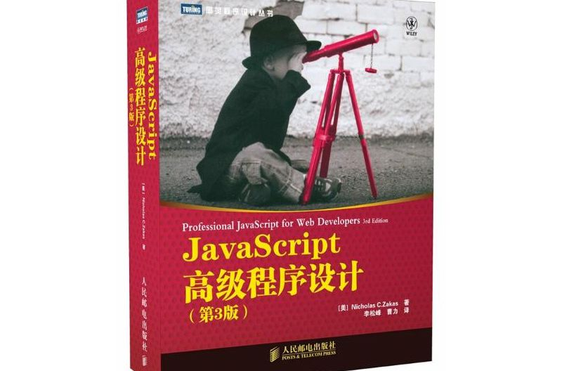

## 缘由

记得第一次看《JavaScript 高级程序设计》这本书是在两年前刚接触前端，花了一点时间大致翻阅了下，随后就把这本书当做工具书来用。工作两年后，虽然面对的业务千奇百怪但都能查查手册 Cover 住，但是深究起来就不知所以，比如：

> 函数执行时内部会有哪些操作？  
> 顺便讲讲其中涉及的闭包、变量提升、作用域链？

作为两年前端再搞不明白，那真是惭愧。

最近抽了工作之余和下班之余重新翻看，为了避免枯燥我就以问答的形式总结，把书中的问题和我自己遇到的问题按照书中章节归类。其中较为基础或者冷门的部分我就不再重述。

## 目录

- 第一章 JavaScript 介绍
- 第二章 在 HTML 中使用 JavaScript
- 第三章 基本概念
- [第四章 变量-作用域和内存问题](/di-si-zhang-bian-liang/)
- [第五章 引用类型](/di-wu-zhang-yin-yong-lei-xing/)
- [第六章 面相对象的程序设计](/di-liu-lu-zhang-mian-xiang-dui-xiang/)
- [第七章 函数表达式](/di-qi-zhang-han-shu-shuo-biao-da-shi/)
- [第八章 BOM](/di-ba-zhang-BOM/)
- [第九章 客户端检测](/di-jiu-zhang-ke-hu-duan-jian-ce/)
- [第十章 DOM](/di-shi-zhang-DOM/)
- [第十一章 DOM 拓展](/di-shi-yi-zhang-DOM-tuo-ta-zhi-zhan/)
- [第十二章 DOM2 和 DOM3](/di-shi-er-zhang-DOM2-he-huo-hu-DOM3/)
- [第十三章 事件](/di-shi-san-zhang-shi-jian/)
- 第十四章 表单脚本
- 第十五章 使用 Canvas 绘图
- 第十六章 HTML5 脚本编程
- [第十七章 错误处理及调试](/di-shi-qi-zhang-cuo/)
- 第十八章 JavaScript 与 XML
- 第十九章 E4X
- [第二十章 JSON](/di-20-zhang-json/)
- [第二十一章 Ajax 与 Comet](/di-er-shi-yi-zhang/)
- [第二十二章 高级技巧](/di-er-shi-er-zhang/)
- [第二十三章 离线应用与客户端存储](/di-er-shi-san-zhang/)
- 第二十四章 最佳实践
- 第二十五章 新兴的 API

## 其他

如果文章中有错误的表述，可以从文章 Title 下方的 Github 进入页面原文提交 PR，谢谢了！
