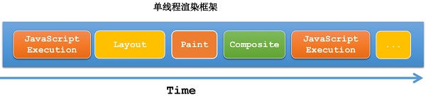
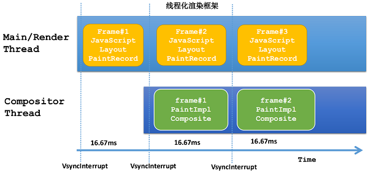
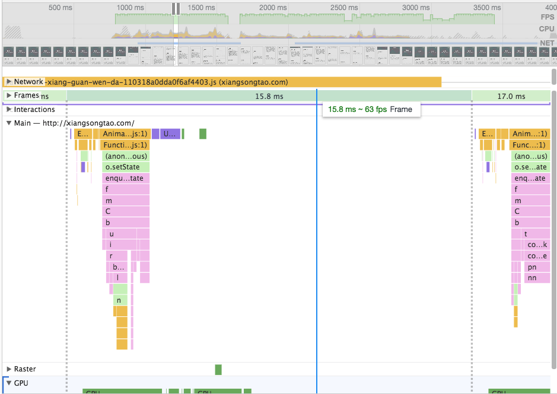

解决题述的问题需要清楚用户在滑动页面时，Chrome 在背后的工作过程，了解了工作过程解题就会水到渠成。

## 基础：Chrome 线程化渲染框架

之前提到过这样的一个浏览器渲染线性流程，这里简单说下：



在传统浏览器中，主线程的执行是**单线程渲染模式**，JS 执行及页面布局渲染在一个线程中串行执行（根据修改的 CSS 元素不同会跳过部分执行阶段）。为了保证 UI 流畅需要每一帧上述的处理时间小于 10ms。

为了优化上述过程，Chrome 浏览器内核对**Composite 部分**从主线程拆分出来到**Compositor 线程**，并行执行 UI 渲染工作，因此效率会高很多。



由图可看出，第 N 帧的内容一旦准备完毕就交给**Compositor Thread**进行渲染。

**到这里你需要知道：**

- <mark>**JS 执行线程**和**Render 线程**是在同一个**内核线程**中</mark>
- <mark>**内核线程**完成布局和绘制记录操作，**Compositor Thread**完成帧渲染</mark>
- <mark>两个线程并行执行</mark>

## 基础：Passive Event Listeners

### 存在的问题

在滚屏事件中（mousewheel、touchmove）如果调用了`preventDefault()`后会阻止默认行为——**禁止滚屏行为**。因此，传统浏览器会将绑定的事件处理程序作为 Task 传到 Task Queue 中等待主线程空闲后执行。因此，这里会有个等待执行的延迟。


当执行完毕后会确认是否有`preventDefault()`调用，如果没调用则将布局信息传给**Compositor Thread**进行渲染。

### 解决方案

Chrome51 之后版本对上述问题进行了优化：**Passive Event Listeners**。

可以在注册事件时，给第三个参数传递`{passive:true}`，主动告知 Chrome 绑定的事件中没有调用`preventDefault()`的行为，因此 Chrome 浏览器就能不等待主线程执行事件处理程序，直接将 Layout 等信息交给**Compositor Thread**进行渲染。如下面代码所示：

```js
function handler(event) {
  console.log(event.type); // log event type
}
document.addEventListener("mousewheel", handler, { passive: true });
```

### 其他

如果在上述代码的回调中调用了`preventDefault()`会如何？

浏览器发出 Error，页面不会因此停止滚动。

```
Error: Unable to preventDefault inside passive event listener invocation.
```

**这个过程你需要知道：**

- 滚屏事件中如果不调用`preventDefault()`则加上`{passive:true}`参数
- **Passive Event Listeners**特性是为滚动流畅性而设计
- Chrome51+支持

## 基础：CSS 中的`touch-action`属性

上面提到的阻止默认行为，通过 CSS 的`touch-action`也能做到。

> CSS 属性`touch-action`用于指定某个给定的区域是否允许用户操作，以及如何响应用户操作。

当元素 CSS 属性设置了`touch-action: none;`时，在它上面拖动是不会有效果的，类似于设置了`preventDefault()`，但是没有主线程参与这个过程。

## 基础：CSS 中的`event-pointer`属性

滚动时如果触及到的元素具有 hover 属性后会触发 hover 特性，页面会进行 Paint，通过 event-pointer: none 禁止鼠标行为，减少不必要的 RePaint。

## 结论：滚动优化方案

以上的基础介绍估计你就知道如何进行滚动性能优化了：

- 事件注册使用 passive 属性
- 使用 event-pointer 属性禁止触发元素滚动，或者指定滚动方向

此外，还需要通过 JS 手段对滚动进行节流，比如将滚动事件回调放在`requestAnimationFrame`中执行。如果滚动事件中有 DOM 尺寸读取或者修改，遵循这样的方式：

- 先读取想获取的 DOM 尺寸
- 元素修改在`requestAnimationFrame`中进行

```js
el.addEventListener("touchmove", function() {
  // Read
  var h2 = element2.clientHeight;
  // Write
  requestAnimationFrame(function() {
    element2.style.height = h2 * 2 + "px";
  });
});
```

## 查看控制台

打开启控制台，选择 Performance，然后录制滚动过程，查看滚动式的 FPS 及此时的 JS 调用栈及使用时间，比如下面的例子。



可以自己体验下：[http://xiangsongtao.com/](http://xiangsongtao.com/)。

每一帧大概在 16ms 左右，页面滚动的回调函数包裹在`requestAnimationFrame`中执行，且每次执行时间没超过 5ms，帧数在 60fps 左右。

## 参考

- [使输入处理程序去除抖动](https://developers.google.com/web/fundamentals/performance/rendering/debounce-your-input-handlers)
- [让页面滑动流畅得飞起的新特性：Passive Event Listeners](http://geek.csdn.net/news/detail/109167?locationNum=9&fps=1)
- [MDN: touch-action](https://developer.mozilla.org/zh-CN/docs/Web/CSS/touch-action)
