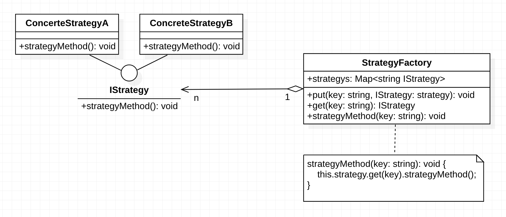

# 设计模式之——策略模式

### 背景

在现实生活中，存在实现一个目标有多种策略可供选择的情况，比如：出门旅行的多种目的地、乘车方式等；超市打折促销的方式；吃饭做菜时，土豆丝的多种做法等；

在软件开发过程中也会遇到此类问题（模式），当实现某个功能存在多种策略时，我们根据环境（Context）或者条件（Condition）的不同，选择指定的策略。比如进行排序，有冒泡排序、选择排序、插入排序、二叉树排序等。


> 反例介绍

当代码中存在根据环境进行多重if-else判断时，增加策略会导致源码有较大修改，导致条件语句结构复杂不移维护，违背**开闭原则**。此时采用策略模式就能很好的解决该问题。


### 定义及特点

策略模式（Strategy）：该模式定义了一些列算法，并将算法封装起来，使他们能够互相替换，且算法的变化不影响使用算法的用户（Context）。策略模式属于对象行为模式，将算法具体实现进行封装（把**使用算法**和**算法实现**分割开来，**算法实现**委派不同的对象进行管理）。

#### 1. 主要优点

- 多重条件语句不易维护，而使用策略模式可以避免使用多重条件语句。
- 策略模式提供了一系列的可供重用的算法族，恰当使用继承可以把算法族的公共代码转移到父类里面，从而避免重复的代码。
- 策略模式可以提供相同行为的不同实现，客户可以根据不同时间或空间要求选择不同的。
- 策略模式提供了对开闭原则的完美支持，可以在不修改原代码的情况下，灵活增加新算法。
- 策略模式把算法的使用放到环境类中，而算法的实现移到具体策略类中，实现了二者的分离。

#### 2. 主要缺点

1. 客户端必须理解所有策略算法的区别，以便适时选择恰当的算法类。
2. 策略模式造成很多的策略类。


### 结构及实现

策略模式是准备一组算法，并将这组算法封装到一系列的**策略类**里面，作为一个抽象策略类的子类。**策略模式的重心不是如何实现算法，而是如何组织这些算法**，从而让程序结构更加灵活，具有更好的维护性和扩展性，现在我们来分析其基本结构和实现方法。

#### 1. 模式的结构

策略模式的主要角色如下。

1. 抽象策略（Strategy）类：定义了一个公共接口，各种不同的算法以不同的方式实现这个接口，环境角色使用这个接口调用不同的算法，一般使用接口或抽象类实现。
2. 具体策略（Concrete Strategy）类：实现了抽象策略定义的接口，提供具体的算法实现。
3. 环境（Context）类：持有一个策略类的引用，最终给客户端调用。


#### 2. 模式的实现

```typescript
interface IStrategy {
  strategyMethod(): void;
}

class Context {
  private strategy: IStrategy;

  setStrategy(strategy: IStrategy): void {
    this.strategy = strategy;
  }
  getStrategy(): IStrategy {
    return this.strategy;
  }
  strategyMethod() {
    this.strategy.strategyMethod();
  }
}

class ConcreteStrategyA implements IStrategy {
  strategyMethod(): void {
    console.log('具体策略A的策略方法被访问！');
  }
}
class ConcreteStrategyB implements IStrategy {
  strategyMethod(): void {
    console.log('具体策略B的策略方法被访问！');
  }
}

const context = new Context();
const csa = new ConcreteStrategyA();
const csb = new ConcreteStrategyB();

context.setStrategy(csa);
context.strategyMethod();
console.log('------------');
context.setStrategy(csb);
context.strategyMethod();

// 具体策略A的策略方法被访问！
// ------------
// 具体策略B的策略方法被访问！
```


### 应用场景

策略模式在很多地方用到，如 JavaSE 中的容器布局管理就是一个典型的实例，Java SE 中的每个容器都存在多种布局供用户选择。在程序设计中，通常在以下几种情况中使用策略模式较多。

1. 一个系统需要动态地在几种算法中选择一种时，可将每个算法封装到策略类中。
2. 一个类定义了多种行为，并且这些行为在这个类的操作中以多个条件语句的形式出现，可将每个条件分支移入它们各自的策略类中以代替这些条件语句。
3. 系统中各算法彼此完全独立，且要求对客户隐藏具体算法的实现细节时。
4. 系统要求使用算法的客户不应该知道其操作的数据时，可使用策略模式来隐藏与算法相关的[数据结构](http://c.biancheng.net/data_structure/)。
5. 多个类只区别在表现行为不同，可以使用策略模式，在运行时动态选择具体要执行的行为


### 拓展

在一个使用策略模式的系统中，当存在的策略很多时，客户端管理所有策略算法将变得很复杂，如果在环境类中使用**策略工厂模式**来管理这些策略类将大大减少客户端的工作复杂度，其结构图如图所示。




