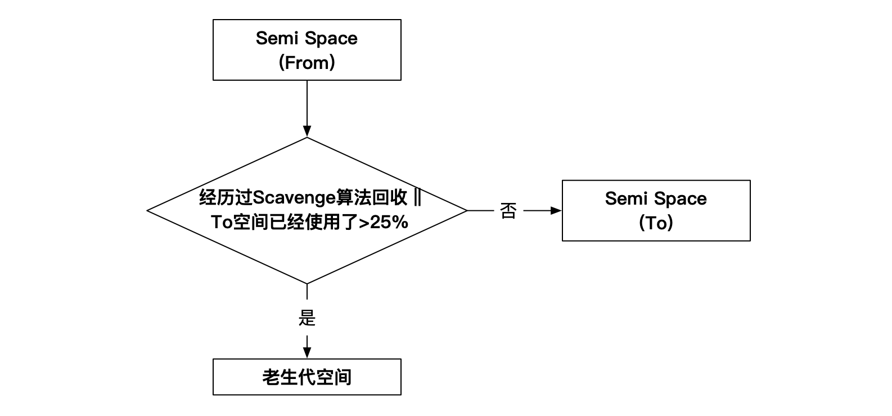
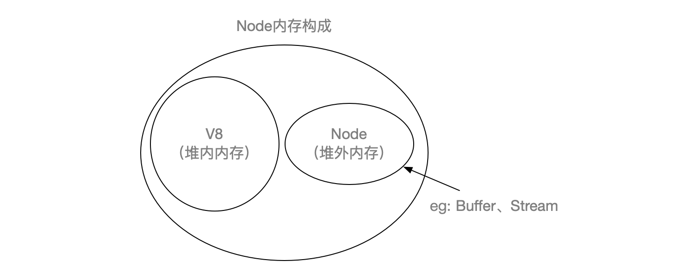

### 1. V8为什么会有内存限制，原因是什么，如何解除？

**V8限制堆的大小，分为两个层次的原因：**

1. **表层原因**：是因为V8最终为浏览器设计，大内存使用场景无法遇到；
2. **深层原因**：是因为V8的垃圾回收机制限制。以1.5G的垃圾回收堆内存为例，一次小回收需要50ms以上，做一次非增量式的垃圾回收甚至要1s以上。垃圾回收过程JS线程暂停，应用性能和响应能力直线下降。限制是一个好选择（JAVA也有类似的设计）。

**解除方式：**

可以在Node启动的时候增加额外的启动参数调整old和new两个内存限制的大小：

``` shell
node --max-old-space-size=1700 test.js // 单位为MB
node --max-new-space-size=1024 test.js // 单位为KB
```


### 2. 简述V8的垃圾回收机制，为什么会有内存分代？

V8的垃圾回收策略主要基于**分代式垃圾回收机制**。使用分代式的原因：

1. **没有一种垃圾回收算法**能够胜任所有场景；
2. 按照**对象的存活时间**将内存的垃圾回收进行不同的分代，不同分代实施不同的策略更高效；

**分代方式及大小：**


V8内存分代分为两部分：**新生代内存空间**和**老生代内存空间**；内存对应的默认最大大小如上图；不同分代执行的算法不同。

**Scavenge算法（新旧Space倒换，引用计数方式）**：通过复制的方式，从**From**到**To**之间复制存活的对象。因为在此分代中（生命周期短的场景），存活的对象只占少部分，因此性能好。对于多次复制依然存活的对象，会转移到老生代中（晋升），转移算法如下。



**Mark-Sweep算法（标记清除）**：只标记活着的对象，对于没标记的对象进行清除；因为死对象在老生代中只占少部分，所以效率高。老生代内存空间主要以此算法为主（Mark-Sweep），但是会存在文件碎片，当空间不足以对分配新晋升的对象是，才使用下面的Mark-Compact算法；


**Mark-Compact算法（标记整理）**：标记内存对象，整理的过程中将活着的和死去的对象分向两头，移动完之后直接清理掉边界之外的内存。


**算法改进部分（顾名思义）**

Mark-Sweep部分 -> Incremental Marking（增量标记）、Lazy-Sweeping（延迟清除）

Mark-Compact部分 -> Incremental Compaction（增量整理）


### 3. 导致内存泄漏的常见类型有哪些，如何规避？

> 闭包：实现 **外部作用域** 访问 **内部作用域** 中变量的方法（一般情况下外部作用域无法方位内部的）

**常见类型及规避方案**

- <u>缓存</u>：1. 增加缓存策略；2. 使用三方缓存方案

- <u>队列消费不及时</u>：1. 监控队列长度；2. 任意异步调用都应该包含超时机制

- <u>作用域未释放</u>：闭包和全局变量两种；通过赋值的方式（undefined or null）解除引用更好。通过delete删除对象属性有可能干扰V8的优化。

<mark>以上场景类型涉及到的对象都在**老生代内存空间**中！</mark>


### 4. 如何理解堆内内存及堆外内存？Node应用的内存构成是？

Node的内存构成主要由 **通过V8进行分配的部分** 和 **Node自定分配的部分**。



所以堆内内存主要指的是V8管理的内存，堆外是Node自行管理的部分，比如Buffer的使用。


### 5. 大内存应用如何处理？

如问题4，使用堆外内存方式处理，比如使用**Stream**方式。使用 **流** 的方式处理，下面代码不会受到V8内存限制的影响，有效的提高程序的健壮性。

```javascript
var reader = fs.createReadStream('in.txt');
var writer = fs.createWriteStream('out.txt')
reader.pip(writer);
```

